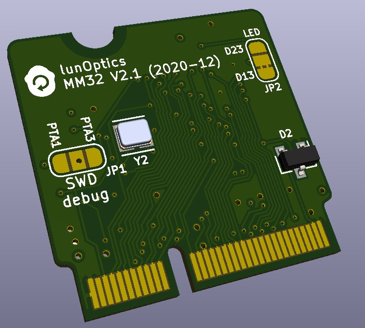

 

# MM32
Experimental NXP MK20DX256 controller board compatible to the SparkFun MicroMod (https://www.sparkfun.com/micromod) system and the [PJRC Teensyduino](https://www.pjrc.com/teensy/teensyduino.html) ecosystem. I.e., the board fits on the SparkFun MicroMod carriers and is able to run firmware written for a Teensy 3.2.

The MM32 board utilizes the un-brickable PJRC bootloader, preprogrammed on the MKL02 chip. Please note: You need to buy the bootloader directly from PJRC (https://www.pjrc.com/store/ic_mkl02.html). It won't work with an empty MKL02.
## Key features:
- Contiguous **8bit port** routed to BUS0-BUS7 (Teensy: PTD0 - PTD7)
- **Two differential ADCs** mapped onto A0/A1 and ADC_D+ ADC_D-
- **True DAC** on PWM_0
- Two **UARTS** (Serial1, Serial2)
- **SPI** interface
- **CAN** Bus
- **Real time clock (RTC)**: 32.679KHz crystal and V_Bat / BAT_VIN/3
supported
- SWD_DIO, SWD_CKL, **debug interface** (bootloader chip can be disabled with a solder bridge on the back side)
- LED pin selectable (solder bridge) between D13 and D23
- Layout optimized for hand soldering

## Functional Pinout

## Production data

### PCB
Gerbers and drill files for the 4 layer, 0.8mm board can be found in the [KiCad/production](/KiCad/Production) folder. Production cost at Chinese board houses are currently (12-2020) less than USD 10 for 10 pieces plus shipping.

### Parts
Here a [link](https://octopart.com/bom-tool/5AbwHvxe) to an Octopart BOM
containing live updated prices and availability from major distributors. It also   provides links to datasheets, and technical information and alternative parts.
### Documentation
Schematic, pictures, pinouts and datasheets can be found in the documentation folder.

### Assembly
If you have experience in soldering SMD parts the assembly is straight forward. You don't need any special equipment. A standard 50W soldering iron (I use [this](https://www.weller-tools.com/professional/EUR/en/Professional/Soldering+technology/Soldering+irons/Low-voltage+soldering+irons/Magnastat/TCP+24+) ) a magnifying glass (e.g. https://www.aliexpress.com/i/4000270805536.html) and a head worn loupe glasses (e.g.  https://www.flume.de/images/product/107683-brillenlupe-mit-3-vergroesserungen/popup/0.jpg) are absolutely sufficient.

The only part I found difficult is  the small bootloader chip (QFN16). The pads on the board are sufficiently long solder the chip by hand in principle. However, it is crucial to align the chip very carefully. Start with one pin and control and align the chip until it fits. It is helpful to apply some flux paste below the chip since this will help keeping it in place during the alignment. Alternatively you can solder it with a hot air gun.

The rest of the parts are small but easy to solder.

Here a video showing the assembly:

## Firmware

The [firmware folder](/Firmware) contains a header defining the
MicroMod <-> Teensyduino pin mappings and a helper class to access the
8bit BUS.
